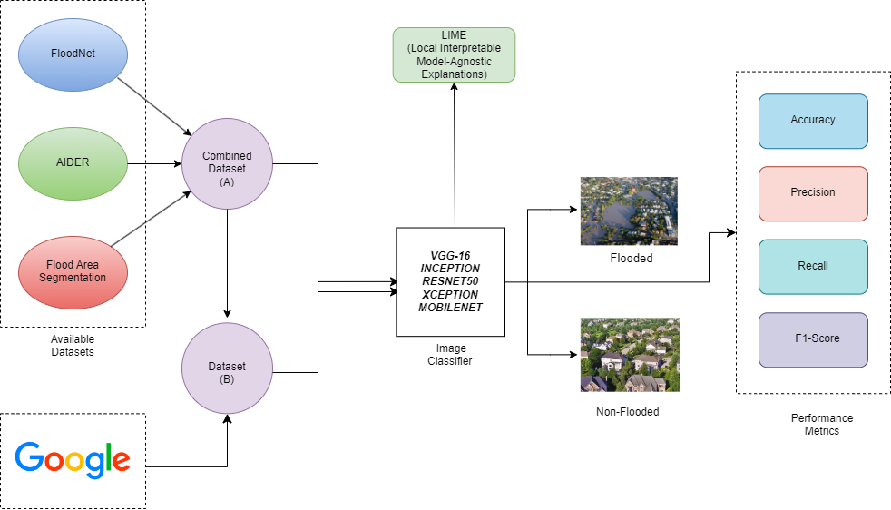

## Aerial Image Classification in Post-Flood Scenarios Using Robust Deep Learning and Explainable Artificial Intelligence

[Paper Link: Aerial Image Classification in Post Flood Scenarios Using Robust Deep Learning and Explainable Artificial Intelligence](https://ieeexplore.ieee.org/document/10891453)

### Abstract
Providing timely assistance to flood-affected regions is a critical challenge, and leveraging deep learning methodologies has shown great promise in addressing such environmental crises. While several studies have proposed methodologies for classifying flood images, most of them are limited by two key factors: first, models are typically trained on images from specific geographic regions, which restricts their ability to generalize to images with varied features or from other regions; second, many models are trained exclusively on high-resolution images, overlooking the classification of low-resolution images. To address these gaps, we have curated a dataset by combining existing benchmark datasets and acquiring images from web repositories. Our goal is to overcome resolution-related challenges and improve model performance across diverse regions. We conducted a comparative analysis of various deep learning models based on CNN architectures using our curated dataset. Our experimental results demonstrated that MobileNet and Xception outperformed ResNet-50, VGG-16, and InceptionV3, achieving an accuracy rate of approximately 98% and an F1-score of 92% for the flood class. Additionally, we employed Explainable AI (XAI) techniques, specifically Lime, to interpret the model results.



### Overview
This directory contains all code related to classification experiments. Each subfolder corresponds to a specific experiment and includes the necessary settings and configurations.

### Directory Structure

- **train_10:** Contains code for an experiment run with an early stopping patience of 10 epochs.
  
- **without_pretrained:** Contains experiments conducted without the use of any pretrained weights.
  
  - **.ipynb:** Other files utilize `imagenet` weights for pretraining.

### Usage

Follow these steps to run any of the experiments:

1. Install Python from [here](https://python.org/).
2. Install the required packages listed in the `requirements` file.
3. Run the appropriate `Jupyter Notebook` file.

### Best Model Weights

1. MobileNet trained on Dataset A is available for download [here](https://github.com/AbdulManaf12/Post-Flood-Disaster-Management/releases/download/v.1.0/A_MobileNet.hdf5).
2. MobileNet trained on Dataset B is available for download [here](https://github.com/AbdulManaf12/Post-Flood-Disaster-Management/releases/download/v.1.0/B_MobileNet.hdf5).

### Contact

For any questions or issues regarding the experiments, please reach out to `abdulmanafsahito@gmail.com`.

## Citation

If you use this work in your research, please cite it as follows:

```
@ARTICLE{manaf,
  author={Manaf, Abdul and Mughal, Nimra and Talpur, Kazim Raza and Talpur, Bandeh Ali and Mujtaba, Ghulam and Talpur, Samar Raza},
  journal={IEEE Access},
  title={Aerial Image Classification in Post Flood Scenarios Using Robust Deep Learning and Explainable Artificial Intelligence},
  year={2025},
  volume={},
  number={},
  pages={1-1},
  keywords={Floods; Disasters; Image Classification; Biological System Modeling; Accuracy; Training; Deep Learning; Benchmark Testing; Adaptation Models; Internet; Artificial Intelligence; Deep Learning; Image Classification; Remote Sensing; Lime; Flood Disaster Dataset},
  doi={10.1109/ACCESS.2025.3543078}
}
```
