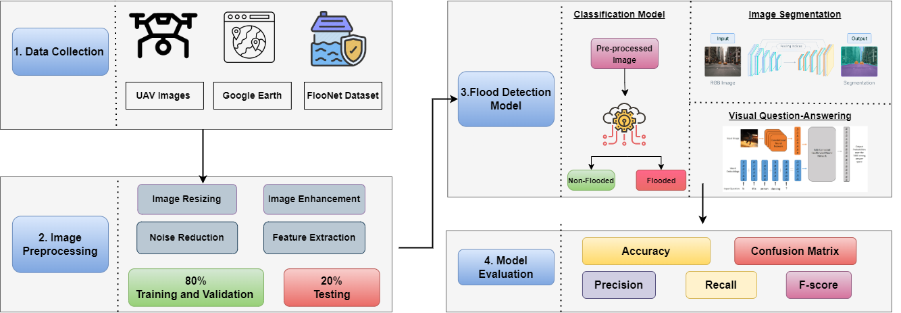

# A Novel Deep Learning and Computer Vision based Intelligent Application for Post-Flood Disaster Management

## Methodology

## Objectives

This study sets out to achieve the following objectives:

1. To detect the flooded regions using UAV images and robust Deep learning methods.
2. To develop a real-time flood monitoring system that can identify the extent of damage in the area.
3. To identify the important objects from the visual data, including buildings, roads, bridges, Humans, cattle, and homes.
4. To develop and evaluate efficient model for image segmentation, Visual Question answering, and image classification

Floods in Pakistan can have a devastating effect on the country, causing damage to infrastructure, homes, and crops and leading to loss of life and displacement of populations. The frequency and intensity of floods have increased due to climate change and extreme weather conditions in recent years. Further, Heavy monsoon rains in the summer months can cause rivers to overflow, leading to widespread flooding. The Indus River, which runs 
through Pakistan, has been particularly prone to flooding. In 2022, Pakistan experienced one of the worst floods in its history, affecting over 33 million people, and more than 1730 lost their lives. In this scenario, there is a need to develop a system that can instantly detect 
flooded regions and identify the severity of damage to initiate rescue and evacuation activities as quickly as possible. In this regard, several Artificial Intelligence (AI) based techniques are developed for efficient post-flood management and damage assessment, whereas the work is very limited for Pakistan. Therefore, we propose a reliable system for a post-flood management system using Computer vision and robust deep learning methods. In this research, we will use Unmanned Aerial Vehicles (UAVs) or drones to collect high-resolution images during any disaster event; further, advanced image segmentation and classification techniques will be employed to detect flooded buildings, roads, and landmarks. Our proposed system will assist decision-makers in estimating the damage in the area and taking necessary actions at the early stages.

